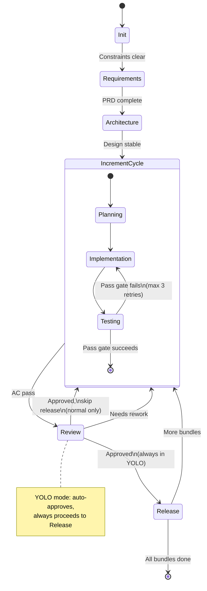
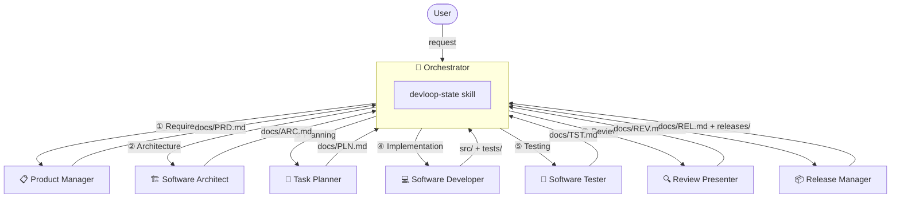
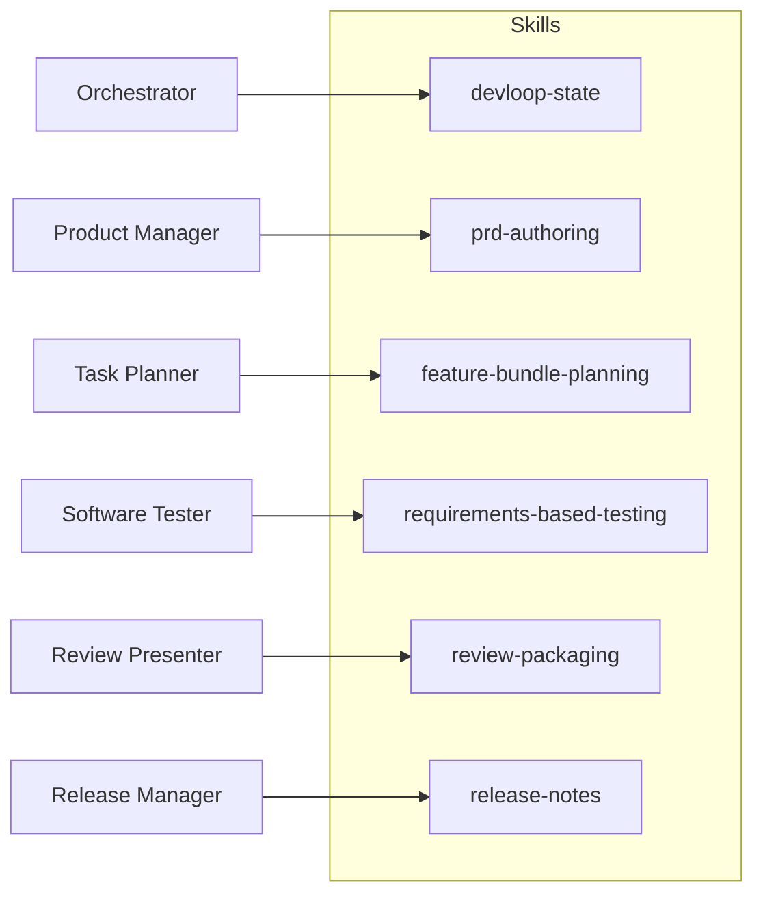
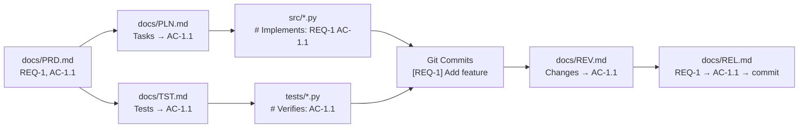
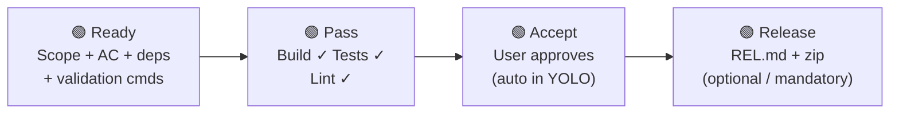
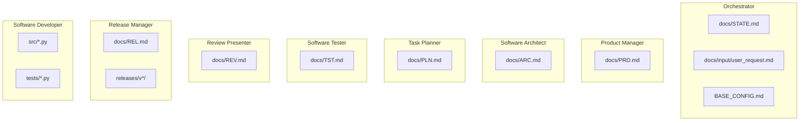

# DevLoop Orchestrator

A document-driven, phase-gated agentic software workflow that produces small, testable, executable increments. Designed for VS Code with GitHub Copilot agents.

## Quick Start

### Commands

Use these prompt shortcuts in VS Code Copilot Chat (type `#` to access):

| Prompt | Description |
|---|---|
| `#devloop-start` | Start a new workflow — capture requirements and begin |
| `#devloop-bulk-start` | Start with a pre-structured request (name, summary, requirements, architecture) |
| `#devloop-bulk-yolo-start` | Start with a pre-structured request and YOLO mode (no approval, auto-release) |
| `#devloop-continue` | Resume the workflow from the current state |
| `#devloop-status` | Show current phase, bundle, progress, and next step |
| `#devloop-cleanup` | Clean up transient artifacts or perform a full reset |

### Setup

```bash
# Create and activate the virtual environment
python -m venv .venv
source .venv/bin/activate   # Linux/macOS
.venv\Scripts\activate      # Windows

# Install dependencies
pip install pygame pytest ruff

# Run the application
python -m src.main

# Run tests
pytest tests/ -v

# Lint
ruff check .
```

## Workflow Overview

The workflow is **document-driven**: the PRD defines expected behavior, the plan selects the active bundle, the tester validates behavior against requirements, and the user accepts only tested, runnable increments.

### Core Principles

- **One active bundle** at a time
- **Tests come from requirements**, not from source code
- **Quality gates** enforce every phase transition
- **Traceability IDs** (`REQ-N`, `AC-N.M`) flow from requirements through tests to commits
- **YOLO mode** available for fully automated cycles (no user approval)

## Phase Diagram



## Agent Architecture



## Agent Roster

| Agent | Phase | Primary Output | Model |
|---|---|---|---|
| `devloop-orchestrator` | All | `docs/STATE.md` | Claude Opus 4.6 |
| `product-manager` | Requirements | `docs/PRD.md` | Claude Opus 4.6 |
| `software-architect` | Architecture | `docs/ARC.md` | Claude Opus 4.6 |
| `task-planner` | Planning | `docs/PLN.md` | Claude Opus 4.6 |
| `software-developer` | Implementation | `src/`, `tests/` | Claude Opus 4.6 |
| `software-tester` | Testing | `docs/TST.md` | Claude Opus 4.6 |
| `review-presenter` | Review | `docs/REV.md` | Claude Opus 4.6 |
| `release-manager` | Release | `docs/REL.md`, `releases/` | Claude Opus 4.6 |

## Phase Banners

Every agent prints a phase banner as the first line of every response. This gives immediate visual feedback about which phase is active and how far along the project is.

| Phase | Banner format |
|---|---|
| Init | `# 🎯 Init` |
| Requirements | `# 📋 Requirements` |
| Architecture | `# 🏗️ Architecture` |
| Planning | `# 📐 Planning — Bundle N/T: <name>` |
| Implementation | `# 💻 Implementation — Bundle N/T: <name> · Cycle R/M` |
| Testing | `# 🧪 Testing — Bundle N/T: <name> · Cycle R/M` |
| Review | `# 🔍 Review — Bundle N/T: <name>` |
| Release | `# 📦 Release` |

- **N/T** — bundle position (completed + current) out of total feature bundles from `docs/PRD.md`.
- **R/M** — iteration number out of max repeats from `BASE_CONFIG.md` guardrails (default 3).

Example: `# 💻 Implementation — Bundle 1/8: Desktop UI & window · Cycle 1/3`

## Agent Interaction Patterns

Agents differ in how they interact with the user during normal mode. Some prompt for decisions, others run autonomously and hand off to the orchestrator.

| Agent | User interaction (normal mode) | YOLO override |
|---|---|---|
| Product Manager | Confirms scope, resolves ambiguity, asks accept/improve | Skip scope/priority prompts, auto-accept |
| Software Architect | Asks accept/improve after presenting design | Auto-accept |
| Task Planner | Asks user to select bundle (if multiple candidates) | Auto-select next unplanned bundle |
| Software Developer | No prompts — implements and hands off | — |
| Software Tester | Shows summary, asks accept/improve | — |
| Review Presenter | Shows summary, asks: **Approve & Next Cycle** / **Approve & Release** / **Needs Rework** | Auto "Approve & Release" |
| Release Manager | Asks version number, audience, migration notes | Auto-increment minor version |

### Review actions

- **Approve & Next Cycle** — accept the increment and move to the next feature bundle (skip release).
- **Approve & Release** — accept the increment and proceed to the Release phase.
- **Needs Rework** — reject with feedback; the reviewer records rework notes and returns to the increment cycle.

## Skills

Skills are reusable procedures invoked by agents via `tools:` frontmatter.



| Skill | Purpose |
|---|---|
| `devloop-state` | Read/write workflow state from `docs/STATE.md` |
| `prd-authoring` | Author PRD with `REQ-N` / `AC-N.M` IDs |
| `feature-bundle-planning` | Create task plan with AC traceability |
| `requirements-based-testing` | Design tests from requirements, not source code |
| `review-packaging` | Assemble review package with AC traceability |
| `release-notes` | Generate release notes with traceability table and zip packaging (`src/`, release notes, change log) |

## Traceability

Every requirement and acceptance criterion carries a stable, unique ID that flows through all artifacts.



| Artifact | ID Format | Example |
|---|---|---|
| Requirement (feature bundle) | `REQ-<N>` | `REQ-1`, `REQ-2` |
| Acceptance criterion | `AC-<N>.<M>` | `AC-1.1`, `AC-2.3` |

**ID rules**: IDs are assigned once and never reused. Retired items are marked `(Retired)` — rows are never deleted.

## Quality Gates



| Gate | Condition |
|---|---|
| **Ready** | Bundle has scope, acceptance criteria, dependencies, and validation commands |
| **Pass** | Build succeeds, tests pass, lint checks pass |
| **Accept** | User approves the runnable increment (auto-satisfied in YOLO mode) |
| **Release** | Release notes, traceability table, and zip archive in `releases/v<major.minor.sub>/` |

## YOLO Mode

When enabled, the workflow runs fully automated — no user approval needed at any phase, and releases are created after every cycle.

| Behavior | Normal Mode | YOLO Mode |
|---|---|---|
| Requirements scope/accept | User prompted | Auto-accepted |
| Architecture accept | User prompted | Auto-accepted |
| Bundle selection | User prompted (if ambiguous) | Auto-select next unplanned |
| Review approval | User prompted (3 actions) | Auto "Approve & Release" |
| Release | Optional (user chooses) | Mandatory every cycle |
| Version number | User prompted | Auto-incremented (minor) |
| Quality gates (Ready, Pass) | Enforced | Enforced |

**Enable**: set `## YOLO Mode` to `Enabled` in `docs/STATE.md`.

## Document Ownership

Each document has exactly one owning agent. Only the owner creates or modifies its document.



## Project Layout

```
├── BASE_CONFIG.md          # Stack, guardrails, quality gates, YOLO mode
├── AGENTS.md               # Agent roster, skills, document ownership
├── README.md               # This file
├── src/                    # Application source code (generated by workflow)
│   └── assets/             # Images, sounds, fonts
├── tests/                  # Test code (mirrors src/)
├── docs/                   # Workflow documents (created from templates)
│   ├── STATE.md            # Current phase and YOLO mode flag
│   ├── PRD.md              # Product requirements with REQ/AC IDs
│   ├── ARC.md              # Architecture and design
│   ├── PLN.md              # Active bundle plan with AC traces
│   ├── TST.md              # Test spec with AC coverage matrix
│   ├── REV.md              # Review package with AC traceability
│   └── REL.md              # Release notes with traceability table
├── releases/               # Versioned release archives
│   └── v0.1.0/
│       ├── release-v0.1.0.zip
│       └── REL.md
└── .github/
    ├── agents/             # Agent definitions (.agent.md)
    ├── skills/             # Reusable skill procedures (SKILL.md)
    ├── prompts/            # Workflow prompt shortcuts (.prompt.md)
    └── templates/          # Document templates (copied to docs/)
```

## Stack

| Category | Value |
|---|---|
| Languages | Python 3.12+, Bash |
| UI framework | pygame |
| Test framework | pytest |
| Linters | ruff (Python), shellcheck (Bash) |
| Target platforms | Linux, Windows |
